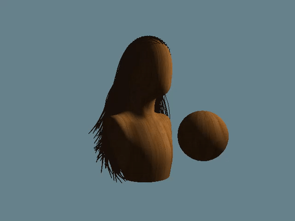
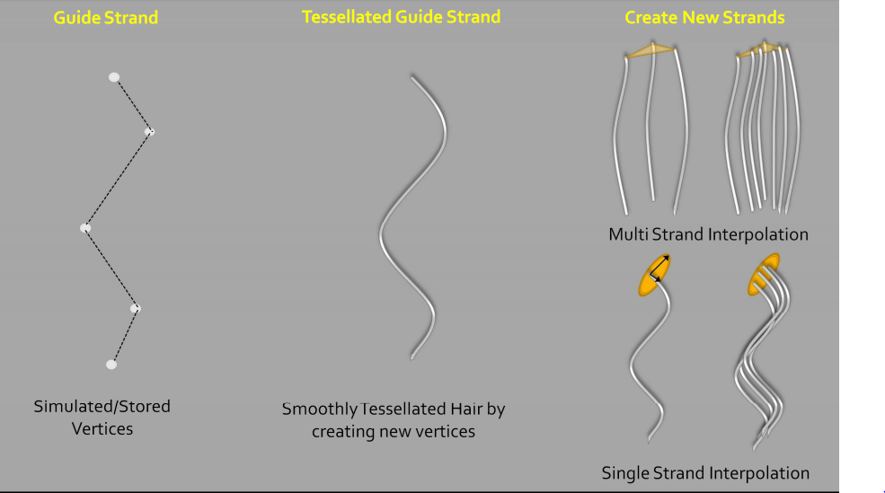

# Realtime Vulkan Hair
**University of Pennsylvania, CIS 565: GPU Programming and Architecture,
Final Project**

* Grace Gilbert: [LinkedIn](https://www.linkedin.com/in/grace-gilbert-2493a0156/), [personal website](http://gracelgilbert.com/)
* Caroline Lachanski: [LinkedIn](https://www.linkedin.com/in/caroline-lachanski/), [personal website](http://carolinelachanski.com/)

Tested on: TBD

# Overview
Simulating hair is an important challenge in computer graphics. A head of hair can contain approximately 1,000,000 strands of hair. These strands exhibit inextensible spring-like behavior, meaning their behavior is similar to a string of linked, very stiff springs. The many strands must interact with each other and external opbjects, as well as with light. Light is scattered through hair in a variety of ways, creating proper highlihts and shadows. To acheive 

We created a real-time hair simulation using Vulkan. Our pipeline simulates physics on a relatively small number of guide hairs, duplicates these guide hairs to increase the visual density of the hair, and then renders the strands with approximated physically based scattering. The user is able to interact with the hair in real time, moving a collision sphere throughout the head of hair. 

# Milestones
- [Pitch](presentations/ProjectPitch.pdf)
- [Milestone 1](presentations/Milestone1.pdf)
  - Set up project base
  - Follicle placement from sampling mesh
  - Physics simulation in compute shader (no collisions yet)
  - Bezier interpolation between strand curve points in tessellation shader
  
# Implementation
## Pipeline
We start by placing guide hair strands on the surface of the head geometry. Each strand is a string of individual points. In a compute shader, we simulate physics on the points of these guide strands. Then in the render process, we tessellate the input points of the strands. First we connect the strand points using Bezier interpolation between the points, to create a smooth, curved strand of hair. Next, also in the tessellation stage, we duplicate the guide strands to add density to the hair. After tessellation, the strands are isolines, 1D line segments. The strands are then passed through a geometry shader, which convertes the isolines into triangles. Finally, shading and lighting are applied in the fragment shader, and the hair is rendered to screen.

## Physics
To simulate the spring-like behavior of the hair strands, we use a Follow-the-Leader (FTL), Position Based Dynamics (PBD) approach. Each strand is split into many segments, each like little springs. Because hair does not stretch significantly, the springs are very stiff. To simulate very stiff springs using a more physically based mass-spring system would be very costly and inefficient. Instead, we apply FTL to ensure that the segments maintain their length. 

We start with the PBD technique of updating the point position according to its current position, velocity, and force. This is where any external forces, such as gravity and wind, get applied. The base point of each strand remains pinned to the head.

Next, we apply FTL as a constraint, moving the updated point position to the closest position that is the correct distance from the parent point on the strand. To do this, we find the direction of the point to its parent point (the adjacent point that is closer to the root of the strand). We move the point along this direction so that it is a predetermined distance away from the parent. This distance is the length of the strand divided by the number of segments.

Once we have the updated position of the point with the FTL constraint applied, we update the points current velocity. The simple method of taking the change in position over the change in time does not preserve an even mass distribution over the strand. Instead, we use the following calculation to determine the point's new velocity:

In this equation, i refers is the point we are currently updating and i + 1 refers to the point below it, farther from the root. d refers to the correction vector of the point, meaning the difference between its previous frame's position and its updated position. Because this velocity update requires correction vector of the point below, and we calculate position updates in order of root to tip, we perform this corrected velocity update after all points have had their position updated.

The following gif demonstrates what the hair dynamics look like with this simulation model applied. There are no additional constraints or collissions.

### Object Collision
### Hair-Hair Collision
## Tessellation
### Bezier Curves
### Strand Interpolation
## Rendering
### Single Scattering
### Shadow Mapping
### Multiple Scattering

# References

