# Realtime Vulkan Hair
**University of Pennsylvania, CIS 565: GPU Programming and Architecture,
Final Project**

* Grace Gilbert: [LinkedIn](https://www.linkedin.com/in/grace-gilbert-2493a0156/), [personal website](http://gracelgilbert.com/)
* Caroline Lachanski: [LinkedIn](https://www.linkedin.com/in/caroline-lachanski/), [personal website](http://carolinelachanski.com/)

Tested on: Windows 10, i9-9900K @ 3.60GHz 64GB, GeForce RTX 2080 40860MB

<p align="center">
  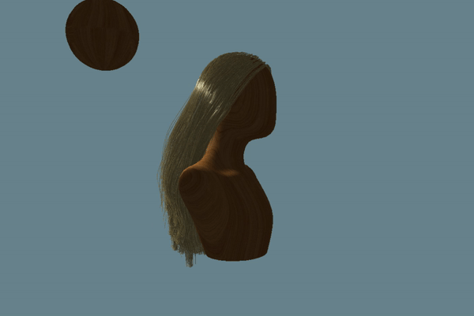
</p>

# Overview
Simulating and rendering hair in realtime is an important challenge in computer graphics for many reasons. A head of hair can contain approximately 1,000,000 strands of hair. These strands exhibit inextensible spring-like behavior, meaning their behavior is similar to a string of linked, very stiff springs. Additionally, the many strands must interact with each other and external objects. Hair also exhibits a number of interesting visual properties, and can't be properly represented with traditional realtime rendering techniques.

We created a real-time hair simulation using Vulkan. Our pipeline simulates physics on a relatively small number of guide hairs, duplicates these guide hairs to increase the visual density of the hair using the tessellation hardware, and then renders the strands with approximated physically-based scattering. The user is able to interact with the hair in real time, moving a collision sphere and light throughout the head of hair. 

# Milestones
- [Pitch](presentations/ProjectPitch.pdf)
- [Milestone 1](presentations/Milestone1.pdf)
  - Set up project base
  - Follicle placement from sampling mesh
  - Physics simulation in compute shader (no collisions yet)
  - Bezier interpolation between strand curve points in tessellation shader
- [Milestone 2](presentations/Milestone2.pdf)
  - Hair-object collision
  - Single strand interpolation
  - Mesh loading and rendering
  - Begin hair-hair collision
- [Milestone 3](presentations/Milestone3.pdf)
  - Extended isolines into triangles with geometry shader
  - Begin single scattering rendering
  - Interactive collision sphere
- Final
  - Hair-hair collision
  - Complete single scattering
  - Shadow mapping
  - Multiple scattering
  - Random strand deviations
  - Multiple strand interpolation
  - Polish
  
<p align="center">
  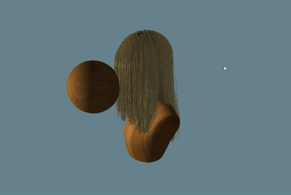
</p>  
# Implementation
## Overview
We start by placing guide hairs on the surface of the head geometry, using a straightforward mesh sampling technique. Each strand is a string of individual points, called curve points. In a compute shader, we simulate physics on the points of these guide strands. Then in the graphics pipeline, we tessellate the input points of the strands. First we connect the strand curve points using Bezier interpolation between the points, to create a smooth, curved strand of hair. Next, also in the tessellation stage, we duplicate the guide strands to add density to the hair using single strand tessellation. The output of the tessellation process is isolines, or line segments. The strands are then passed through a geometry shader, which converts the isolines into camera-facing triangles, allowing us to control the width of the strands. Finally, shading and lighting are applied in the fragment shader using a shadow map and deep opacity map generated in two preceeding render passes, and the hair is rendered to screen.


#### Performance Analysis
The chart below visualizes the effect of the number of guide strands being simulated on the FPS:

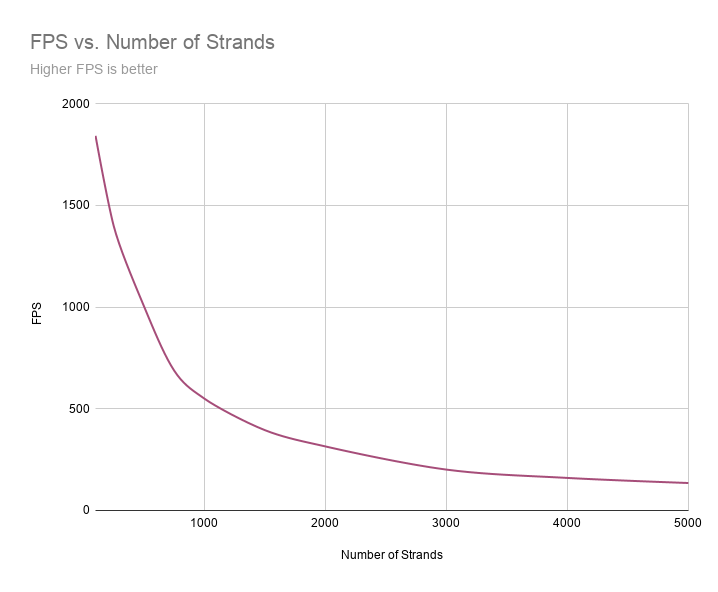

This chart indicates an exponential decrease in FPS as more strands are rendered. However, even with many strands, the FPS is still rendering fast enough for real-time.

## Physics
To simulate the spring-like behavior of the hair strands, we use a Follow-the-Leader (FTL), Position Based Dynamics (PBD) approach. Each strand is split into many segments, each like little springs. Because hair does not stretch significantly, the springs are very stiff. To simulate very stiff springs using a more physically based mass-spring system would be very costly and inefficient. Instead, we apply FTL to ensure that the segments maintain their length. 

Our physics simulation model is based off of Matthias Müller's paper, [Fast Simulation of Inextensible Hair and Fur, Müller et al. (2012)](http://matthias-mueller-fischer.ch/publications/FTLHairFur.pdf).

We start with the PBD technique of updating the point position according to its current position, velocity, and force. This is where any external forces, such as gravity and wind, get applied. The base point of each strand remains pinned to the head.

Below is an example of adding a wind force to the strands:

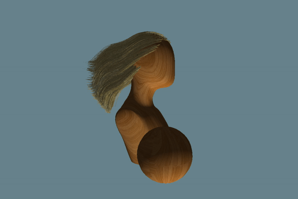

Next, we apply FTL as a constraint, moving the updated point position to the closest position that is the correct distance from the parent point on the strand. To do this, we find the direction of the point to its parent point (the adjacent point that is closer to the root of the strand). We move the point along this direction so that it is a predetermined distance away from the parent. This distance is the length of the strand divided by the number of segments.

Once we have the updated position of the point with the FTL constraint applied, we update the points current velocity. The simple method of taking the change in position over the change in time does not preserve an even mass distribution over the strand. Instead, we use the following calculation to determine the point's new velocity:


In this equation, i refers is the point we are currently updating and i + 1 refers to the point below it, farther from the root. d refers to the correction vector of the point, meaning the difference between its previous frame's position and its updated position. Because this velocity update requires correction vector of the point below, and we calculate position updates in order of root to tip, we perform this corrected velocity update after all points have had their position updated.

The following gif demonstrates what the hair dynamics look like with this simulation model applied. There are no additional constraints or collisions.


### Object Collision
Our approach for object collision is to apply a penalty force upon collision, rather than a preventative technique. This means that our simulation allows strands to enter into the surface of the collision geometry, but as soon as it does, it will get pushed out in the next frame. By making the collision geometry slightly larger than the rendered geometry, the slight collision into the geometry is rarely noticeable. 

When updating the position of a point on the strand, we first check if it is inside one of the collision ellipsoids. If it is, we apply a zero-length spring force to push the point out of the surface. This force is added to the external forces with gravity and any other external forces. The zero-length spring force acts as if there is a very stiff spring such that any distance away from the center of the spring gets penalized. This spring acts along the normal of the surface of the geometry at the point of collision. The force added is the following:

```
PenaltyForce = k * d * normal
```

k represents the spring stiffness, which we set to be very large. d is the depth of the point within the collision object, penalizing deeper collisions more strongly. The normal is the normal of the surface of the ellipsoid at the collision point.

A benefit of this penalty based technique is that it is very simple to apply and is very efficient. It is simple because it just involves updated the force used to update position before applying any constraints.  It is efficient because it does not require multiple iterations of constraint applications. If instead we were to apply collisions as a second constraint, we would have to perform multiple iterations of the position update so that both the FTL constraint and collision constraint are sufficiently satisfied. This would slow down the simulation, making it less suitable for a real time model. 

One downside of the penalty approach is that it is dependent on a small delta time. If there is too much time in between frames, the strands might travel fairly deep within a collision object. The penalty force to correct this collision could become very large, applying a strong force that could cause the simulation to explode and become unstable. However, out simulation is fast enough that the time between frames is low enough for penalty based collisions to work effectively.

The following gif demonstrates hair-object collision:


### Hair-Hair Interaction
To achieve friction between the strands of hair, we create a velocity field out of the strand's velocities and use this field to effectively smooth out the velocities over the strands.

Our hair-hair collision model is based off of Lena Petrovic's paper, [Volumetric methods for simulation and rendering of hair, Petrovic et al. (2005)](https://graphics.pixar.com/library/Hair/paper.pdf).

When we first set the velocity of a point on a strand, we add that point's contribution to a background uniform grid, which is empty at the beginning of each timestep. We add both the density of the point and its velocity contribution to the 8 neighboring grid points. The contribution to each of the 8 points is based on a linear interpolation of the distance in each dimension from the strand point to the grid point:

```
For each of the 8 neighbor gridPoints:
  xWeight = 1 - abs(strandPoint.x - gridPoint.x)
  yWeight = 1 - abs(strandPoint.y - gridPoint.y)
  zWeight = 1 - abs(strandPoint.z - gridPoint.z)

  totalWeight = xWeight * yWeight * zWeight

  gridPoint.density += totalWeight
  gridPoint.velocity += totalWeight * strandPoint.velocity
```
Note that the strand point positions used in the above calculations are their world positions transformed into index grid space, where each grid cell is 1x1x1. Additionally, because multiple strand points may contribute to the same grid point, we must use atomic adds when adding to the grid point values.  

Once all of strand points have added their contributions to the grid, we transfer the grid data back to each of the strands using the same interpolation values for the surrounding 8 grid points:
```
velocityFromGrid = vec3(0)
For each of the 8 neighbor gridPoints:
  xWeight = 1 - abs(strandPoint.x - gridPoint.x)
  yWeight = 1 - abs(strandPoint.y - gridPoint.y)
  zWeight = 1 - abs(strandPoint.z - gridPoint.z)

  totalWeight = xWeight * yWeight * zWeight

  gridPointVelocity = gridPoint.velocity / gridPoint.density
  velocityFromGrid += totalWeight * gridPointVelocity
```
This velocity from grid value represents a smoothed out velocity among the nearby strands of hair. We do not want to set the new velocity directly to this grid velocity, as this will exhibit too much friction and damping. Instead, we have a friction parameter, in our case approximate 0.05, and calculate the final velocity as a mix between the original and the one found on the grid:
```
Friction = 0.05
velocity = (1 - friction) * velocity + friction * velocityFromGrid
```
This grid transfer process causes nearby strands of hair to move with more similar velocities. This mimics friction, as if two strands collide, they will stick together a little bit, meaning their velocities align. This friction causes natural hair clumping, as nearby strands tend to try to move together. You can also notice the friction as the hair falls on itself, cascading down slowly as it falls against other strands. This falling friction can be seen in the following two examples:

Side            |  Back         
:-------------------------:|:-------------------------:
| 

The friction also creates some volume for the hair. If many strands are being pushed towards other still strands, the small velocities of the still strands will gradually transfer over to the strands being pushed towards them, slow those strands down. Because of this gradual slow down, rather than continuing to fall directly on top of the still strands, the moving strands will slow to a stop earlier, creating volume as they rest on top of the still strands. 

The following image exemplifies this volume created by smoothing the velocities:


### Physics Examples
#### Sphere Interaction
Cut Through           | Side            | Back | Front
:-------------------------:|:-------------------------:|:-------------------------:|:-------------------------:
|  | |

#### Varying Wind
Strong Wind          | Gentle Wind           | Strong Wind, Long Hair  | Wind Sphere Interaction
:-------------------------:|:-------------------------:|:-------------------------:|:-------------------------:
| 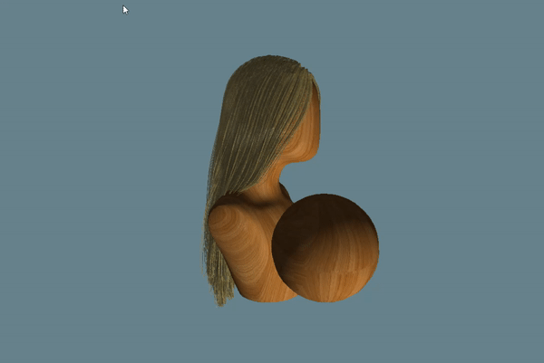 | |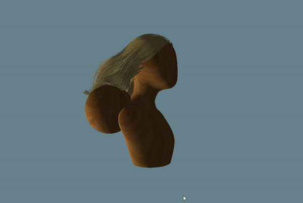

## Tessellation and Geometry Shaders
The above physics is only performed on individual points along each strand of hair. To have the points look like actual hair strands, we need to connect the points with smooth curves, duplicate the guide strands to add density, and convert the hairs from lines to 2D geometry.

### Bezier Curves
Each strand of hair is represented a a string of individual points. To create a smoothly curved hair strand, we interpolate between these points using a Bezier curve interpolation. The Bezier interpolation is performed on each segment of the curve. Each segment is given 4 control points which create a hull for the segment. Based on the distance along the segment, we interpolate between the control points to create a curve that fits the shape of the hull. The control point positions are determined based on the neighboring curve points of the current segment and are placed in such a way that ensures continuity between adjacent segment's curves. 

The following is an example of a Bezier curve (red) with its curve points (blue) and control points and hulls (yellow):


#### Performanace Analysis
The chart below shows the affect of the number of tessellated divisions along each strand on the FPS. Ther more divisions there are, the smoother the bezier curve will be, as we interpolate along the Bezier curve at more positions along the curve:


The FPS exhibits a fairly exponential decrease as the divisions increase up until about 70 divisions, where the FPS seems to plateau. At this point, we hypothesize that there is a maximum number of divisions and increasing the input value does not actually affect the computation. 70 divisions is already significantly more than necessary, and the difference is nearly impossible to detect, but this may explain why the FPS does not continue dropping.

### Strand Interpolation
#### Single Strand

In single strand interpolation, one guide strand is tessellated to become multiple strands surrounding that strand. We tessellate the additional strands in a disc centered on the original strand by mapping the (0, 1) u tessellation coordinate to (0, 2pi) radians and using the angle to calculate a direction from the center. The magnitude of a specific point's direction from the original strand is based on its v tessellation coordinate (essentially a meausure of how far from the root a point is), to create a tapering effect at both the root and the tip. This creates an effect of clumping hairs.

ADD PICTURE 

#### Multiple Strand

TODO

ADD PICTURE

##### Performance Analysis
The chart below shows the affect of the number of interpolated strands per guide strand on the FPS:

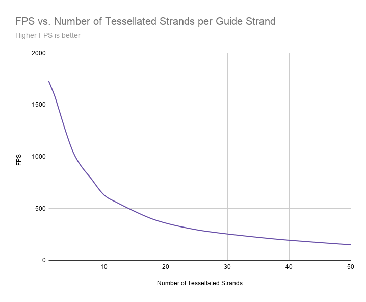

The FPS exhibits a steady exponential falloff as we interpolate more strands for each guide strand, but again, always remains fast enough for real-time for any reasonable number of interpolated strands.

#### Random Strand Deviation
With just single strand and multiple strand interpolation alone, the hair has a very uniform, neat appearance. Realistically, however, individual strands of hair can deviate from the nearby hairs. To achieve this effect, when tessellating strands to duplicate the guide strands, we probabilistically choose to deviate the strands from their guide strand. 

With a probability of 0.5, a strand has some deviation. To get this probability, we choose use a deterministic random function to get a random number between 0 and 1 dependent on the guide strand position and the tessellation value that differentiates individual strands that are interpolated off of the guide strand. This gives each rendered strand a unique random number. If this random number is above 0.5, we apply a deviation. 

If a tessellation point on a hair is deviated, the distance that it gets pushed away from the guide strand is scaled up. This scale does not have to apply to the entire strand, but can vary along the length of the strand, so part of the strand can be more aligned with the guide hair, and other can be deviated to be further away.

There are 5 distributions of deviation, each occuring with equal probability. Some deviations use a gaussian curve to adjust the tessellated strands. One gaussian curve is centered close to the root of the hair, causing stray, deviated hairs at the top of the head. Two other guassian curves cause more deviations towards the bottome of the strands, each with different scales of deviation. Other deviations follow an exponential curve based on the distance along the strand. One exponential deviation very sharply increases towards the tip of the hair, causing flyaway bits at the tips. Another exponential strand is a much more gradual exponential increase, causing almost the whole strand to be deviated.

The below images represent exaggerated versions of the three general deviation shapes (high and low guassian, sharp and gradual exponential):

High Gaussian            |  Low Gaussian         
:-------------------------:|:-------------------------:
| 

Sharp Exponential       |  Gradual Exponential          
:-------------------------:|:-------------------------:
| 

Our method for strand deviation is based off of Markus Rapp's master's thesis, [Real-Time Hair Rendering, Markus Rapp (2014)](http://markusrapp.de/wordpress/wp-content/uploads/hair/MarkusRapp-MasterThesis-RealTimeHairRendering.pdf).

### Geometry Shader
## Rendering

Rendering hair properly is not a trivial task. We identified three important components to a good hair renderer: single scattering, shadowing, and multiple scattering. 

### Single Scattering

Single scattering represents the effect of light on one strand of hair. Most realtime applications use a method derived from the [Marschner Model](http://www.graphics.stanford.edu/papers/hair/hair-sg03final.pdf), which presented a physically-based single scattering model for a curve based on real experimental measurements of hair. The Marschner model defines a scattering function, `S(θi , θo, φi , φo)`, in which `θi` and `φi` are the longitudinal and azimuthal angles of the incoming light direction, respectively, and `θo` and `φo` are the longitudinal and azimuthal angles of the outgoing light direction, respectively. They rewrite `S` as a product of the longitudinal scattering function `M(θi, θo)` and the azimuthal scattering function `N(θd, φd)`. 

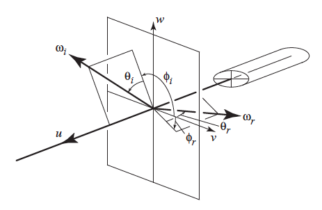

Within each of those functions, they focus on three light paths, finding that these three accounted for the majority of the visual properties seen in real hair. These paths are: R, in which light hits surface and is immediately reflected; TT, in which light transmitted inside hair, then transmitted back out; and TRT, in which light is transmitted inside the hair, reflected at the backside of the hair, then transmitted again. R accounts for the primary reflection, TT for backscattering, and TRT for secondary reflection.

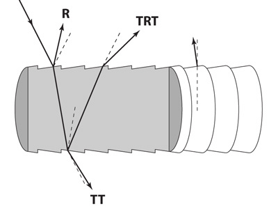

Since 2003, many modifications or approximations have been made to the model since, for reasons such as better performance or better artist directability. For our project, we based our single scattering model on the one presented in the SIGGRAPH 2016 presentation, [Physically Based Hair Shading in Unreal](https://blog.selfshadow.com/publications/s2016-shading-course/karis/s2016_pbs_epic_hair.pdf).

Here you can see the result of the R path, the primary reflection:


In this gif, you can see the transition from primary and secondary reflection to backscattering as the angles to the light source (`θi`, `φi`) change:


Below is another example of backscattering on auburn hair:

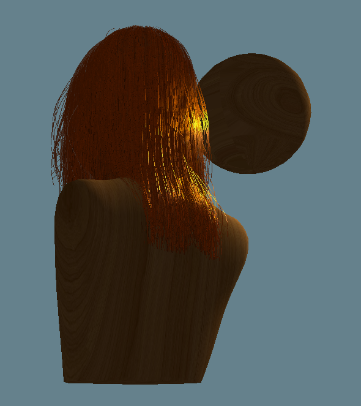

### Shadow Mapping

Self-shadowing is very important in the rendering of hair, as the many strands are constantly shadowing each other. We make use of a traditional shadow mapping pipeline, adding an additional render pass from the light's point of view to produce a depth map that is used to calculate if a fragment is in shadow or not. We found our shadows to be very chunky, often clashing with the delicate look of hair, and made use of Percentage Closer Filtering in our shadow calculation. Rather than sampling one texel in the depth map to determine if a fragment is in shadow, we sample multiple texels surrounding the area and determine what is essentially the shadow percentage. This creates the look of softer shadows at a relatively small performance decrease.

#### Performance Analysis
The chart below shows the affect on FPS of increasing the number of samples per pixel in the shadow depth pass. The more samples per pizel, the softer the shadows appear.

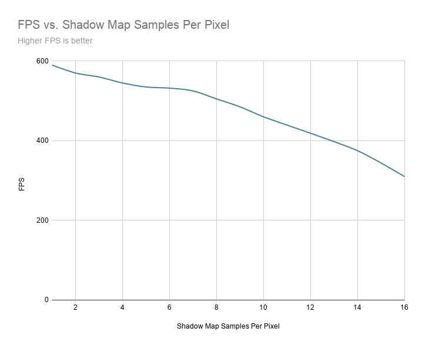

We experimented with the number of samples per pixel to sample, finding little visual improvement beyond 4x4 or 16 samples.

No PCF Applied           |  16-sample PCF         
:---------------:|:-------------------------:
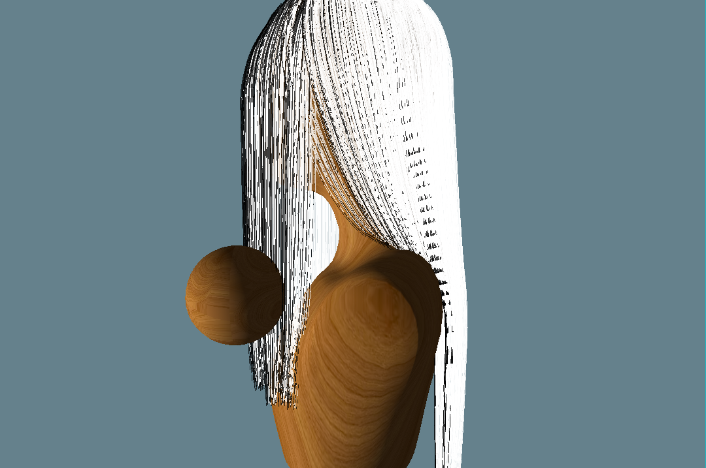| 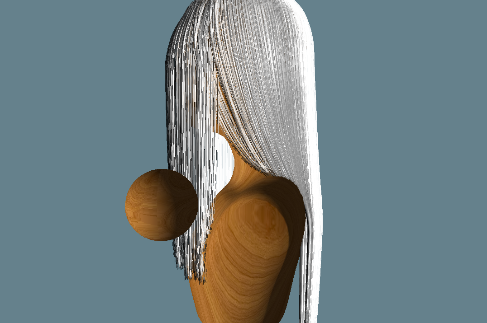

Since hair is a volumetric object, properly representing self-shadowing should go beyond a simple shadow map. We implemented [deep opacity maps](http://www.cemyuksel.com/research/deepopacity/deepopacitymaps.pdf) using an additional render pass following the depth pass. This divides the hairs into several layers from the light's perspective, with each layer being more distant from the light and thus having a higher opacity. Only a small number of layers (such as 3) are required for a good visual result, allowing for the layers to be stored as channels in a single output texture. However, perhaps due to a poor implementation, we found this to look no better (and sometimes worse) than the traditional shadow map method. We continued to use the traditional shadow map for our shadow calculation, but made use of the opacity map in multiple scattering.

### Multiple Scattering

While single scattering results from light bouncing on an individual strand, multiple scattering results from light bouncing between multiple strands. Multiple scattering is very important to the hair model and is necessary for providing most of the hair's color (all of the above rendered hair images also include multiple scattering. Here is what single scattering looks like on its own (with shadows but no ambient light, on blonde hair):


You can see it doesn't really have any color besides the reflections and backscattering!).

As you can imagine, tracing light paths as they bounce off multiple strands is difficult to accomplish without a path tracer. Several approximations have been presented, and for simplicity we used the one shown in [Physically Based Hair Shading in Unreal](https://blog.selfshadow.com/publications/s2016-shading-course/karis/s2016_pbs_epic_hair.pdf). This involves creation of a fake normal vector and approximating the absorption over a light path, for which we used deep opacity maps. Here is the result of multiple scattering alone (blonde hair):

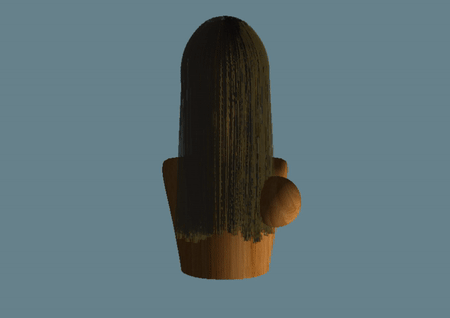

The full scattering model, including single scattering, multiple scattering, shadows, and ambient light, for blonde hair can be seen below:


# Thank You

We'd like to thank Dr. Chenfanfu Jiang for invaluable advice on the physics and collisions portion of this project, Sascha Willems for his speedy assistance with Vulkan, and Baldur Karlsson for creating the godly Renderdoc software.

# References
- [Fast Simulation of Inextensible Hair and Fur, Müller et al. (2012)](http://matthias-mueller-fischer.ch/publications/FTLHairFur.pdf)
- [Volumetric methods for simulation and rendering of hair, Petrovic et al. (2005)](https://graphics.pixar.com/library/Hair/paper.pdf).
- [Position Based Dynamics, Müller et al. (2006)](https://matthias-research.github.io/pages/publications/posBasedDyn.pdf)
- CIS 563 Course Material, Chenfanfu Jiang
- CIS 562 Course Material, Stephen Lane
- [Real-Time Hair Rendering, Markus Rapp (2014)](http://markusrapp.de/wordpress/wp-content/uploads/hair/MarkusRapp-MasterThesis-RealTimeHairRendering.pdf)
- [Sascha Willems's Vulkan dynamic buffer example](https://github.com/SaschaWillems/Vulkan/tree/master/examples/dynamicuniformbuffer)
- [Light Scattering from Human Hair Fibers, Marschner et al. (2003)](http://www.graphics.stanford.edu/papers/hair/hair-sg03final.pdf)
- [Physically Based Hair Shading in Unreal, Brian Karis (2016)](https://blog.selfshadow.com/publications/s2016-shading-course/karis/s2016_pbs_epic_hair.pdf)
- [Deep Opacity Maps, Yuksel and Keyser (2008)](http://www.cemyuksel.com/research/deepopacity/deepopacitymaps.pdf)
- [Sascha Willems's Vulkan shadow mapping example](https://github.com/SaschaWillems/Vulkan/blob/master/examples/shadowmapping/shadowmapping.cpp)
- [Real-Time Hair Rendering on the GPU, Tariq (2008)](https://developer.download.nvidia.com/presentations/2008/SIGGRAPH/RealTimeHairRendering_SponsoredSession2.pdf)

# Bloopers


